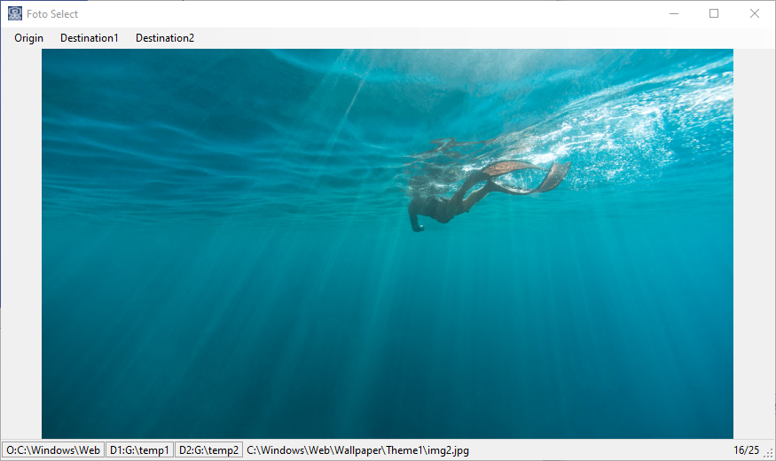

# foto-select

## Description

Small utility I use to select fotos and copy them to 2 folders

I use this application during my photograph selection process, when I want to choose which ones I want to copy to my website and which ones I want to print.

his allows me to loop over my photos directory and simply by pressing `1` or `2`, I can copy the shown image into Destination Folder 1 or 2.

You can move to the next image my pressing `space` or `Right arrow`, and back by pressing `backspace` or `Left arrow`.

This app requires you to select 3 folders before you can start:

1. Origin: the folder where the images you want to select are stored
2. Destination1: folder where image is copyed if you press 1
3. Destination2: folder where image is copyed if you press 1

## Screenshot

